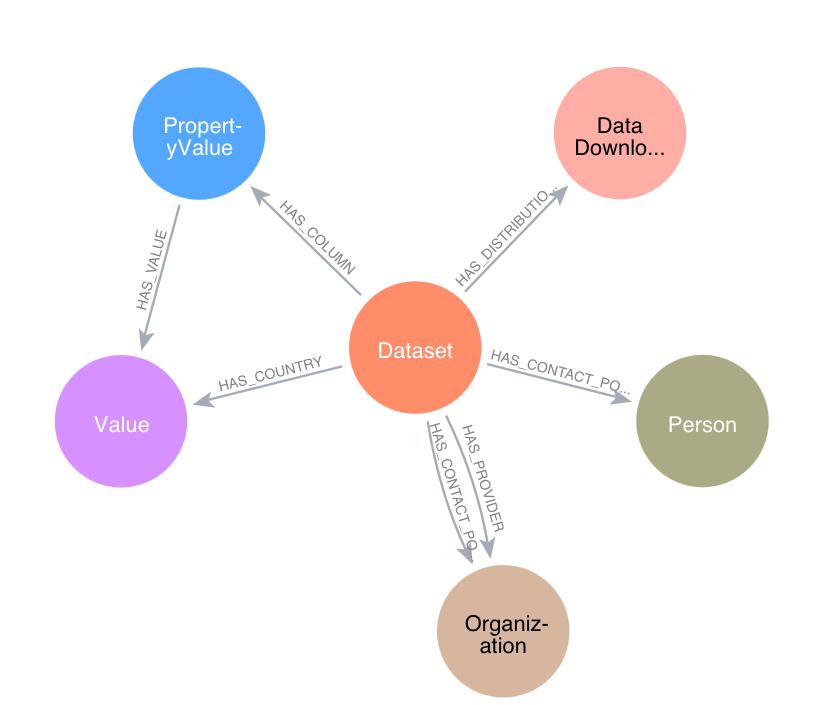

# 🐄 Global Burden of Animal Diseases (GBADs) Metadata Graph Database ETL (Extract, Transform, Load)

## Overview 

This repository contains the code and resources for extracting, transforming, and loading (ETL) data into the a Neo4j graph database. 

The graph database stores and manages metadata from data sources that are used for GBADs calculations and estimates. 

## Table of Contents 

- ✨[Introduction](#introduction)
- 🚀[Usage](#usage)
    - 👩‍💻[Using Database Dumps Locally](#database-local)
    - 🧙‍♂️[Interacting with the Graph Database in RStudio](#interacting-with-graph-database-in-rstudio)
- 🔄[ETL Process](#etl-process)
    - [Directory Structure](#directory-structure)
    - 📊[Data Sources](#data-sources)
- 📈[Graph Database Schema](#graph-database-schema)
- 🔎[Example Queries](#example-queries)
- 🤝[Contributing Data](#contributing)
    - 🌐[Contributing Data](#contributing-data)
- 🪪[License](#license)
- 🙏[Acknowledgements](#acknowledgements)

## ✨ Introduction

The Global Burden of Animal Diseases (GBADs) is a global research programme that uses livestock data from disperate sources to calculate national and global estimates of the economic and health burden of animal diseases.

To manage the Open data sources that GBADs uses, metadata and data from these sources is extracted, cleaned, and loaded into a graph database. This graph database serves as a repository of data, improving the discoverability of data used by GBADs. 

Beyond GBADs, this repository of livestock data can be used for researchers to discover data that may be useful in their work - we expect that this will be useful for climate change researchers, data scientists, epidemiologists and economists. 

💛🦄 *To suggest new sources of data for indexing, please check out the [Contributing Data](#contributing) section of this document* 

## 🚀 Usage

GBADs is currently using a paid Neo4j Aura instance to host the graph database. However, you are still able to interact with the graph database locally using database dumps.

### 👩‍💻 Using Database Dumps Locally

1. If you don't already have it, [download Neo4j Desktop](https://neo4j.com/download/?utm_source=google&utm_medium=PaidSearch&utm_campaign=GDB&utm_content=AMS-X-SEM-Category-Expansion-Evergreen-Search&utm_term=&gad_source=1&gclid=Cj0KCQiAoeGuBhCBARIsAGfKY7yA_XIMqEkjpnmwFmdLJR68V3VG9MZNZKGd1UYkQfBLlY3NQSYFswMaAg8wEALw_wcB)
2. Download the most recent dump file from the `data/dumps` directory
3. Follow the [restore a database dump](https://neo4j.com/docs/operations-manual/current/backup-restore/restore-dump/) instructions from Neo4j Docs 

### 🧙‍♂️ Interacting with Graph Database in RStudio 

Cool examples coming soon....

## 🔄 ETL Process

### Directory Structure

```
├── README.md
├── config
├── data
│   ├── dumps
│   ├── processed
│   │   ├── ethiopia
│   │   ├── faostat
│   │   │   ├── node.csv
│   │   │   └── relationship.csv
│   │   └── woah
│   └── raw
│       ├── ethiopia
│       ├── faostat
│       └── woah
├── etl
│   ├── extract
│   │   └── __init__.py
│   ├── load
│   │   └── __init__.py
│   └── transform
│       ├── __init__.py
│       └── validations
├── examples
└── tests
```

### 📊 Data Sources

Data sources use different standards to report, disseminate, structure and format their data and metadata. Therefore, each data source usually needs an independent set of tools to extract and transform it into the database. Once it is transformed into a common format, it can be loaded in the graph database.

Therefore, each data source has a unique directory in the `data/` directory.

## 📈 Graph Database Schema 



FIXME add more info about actual schema validation

### Nodes

DataDownload: https://schema.org/DataDownload


## 🔎 Example Queries

This repository is linked to the [GBADs-Metadata-API](https://github.com/GBADsInformatics/GBADs-Metadata-API) repository, which provides queries, tools, and tests to query the graph database.

<!-- ## ⚡️ Performance Optimization

The performance optimization strategy: https://neo4j.com/docs/operations-manual/current/performance/

### Batch Size 

### Indexing 

### Cypher Query Optimization -->

## 🤝 Contributing

We would love to see others contribute code. Since we are using a fully-managed Neo4j Aura service, contributions to code are restricted to metadata extraction and preparation. 

### 🌐 Contributing Data

If you have a new data source that you'd like to contribute or see added to the metadata store, we would love your input. 
* To contribute data, create an issue in this repository. 
* Please provide a *direct* link to your dataset (not just a landing page). 
* If a direct link is not available, please provide *instructions* on how to access the data of interest. 
* Please provide a link to the licensing information or use instructions for the dataset. We are only adding *Open* data to the graph.

If the data of interest is in a PDF table, please also share. We will mark it with an additional tag and consider scraping it. 

<!-- ## 🪪 License  -->


<!-- ## Disclaimer

This project is provided "as-is" with no warranties or guarantees. Use it at your own risk. The maintainers and contributors are not responsible for any damages or liabilities related to the use, modification, or distribution of this project. -->

## 🙏 Acknowledgments

We acknowledge the support of the Bill and Melinda Gates Foundation. 

This work has been conducted, in part, for my PhD work which is funded by the Natural Sciences and Engineering Research Council of Canada (NSERC) CGS-D award. 
